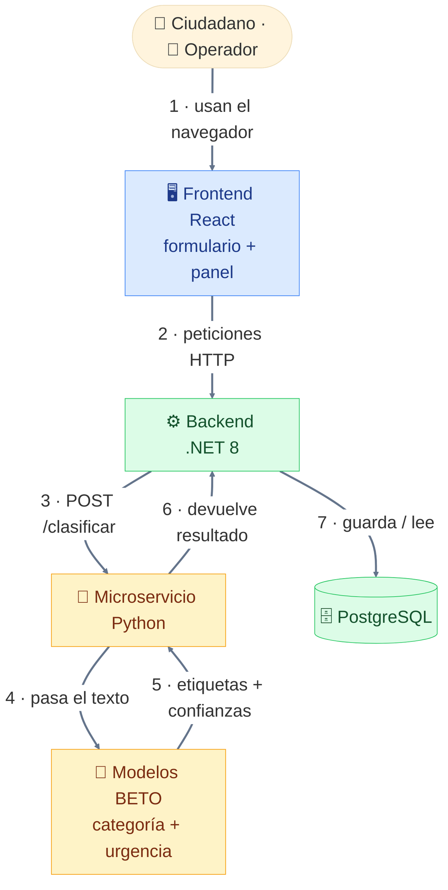
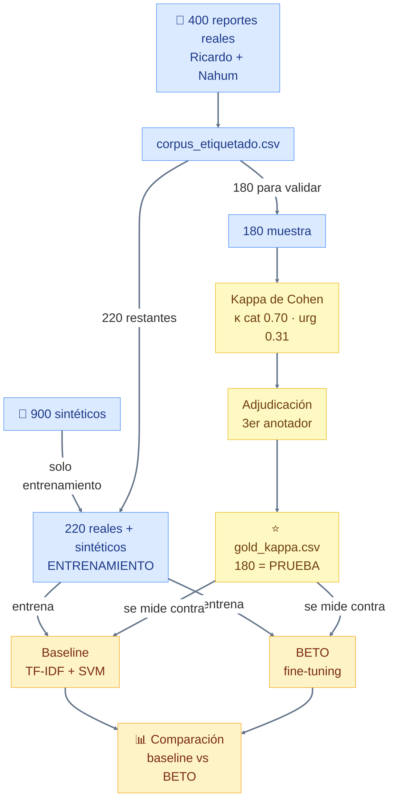
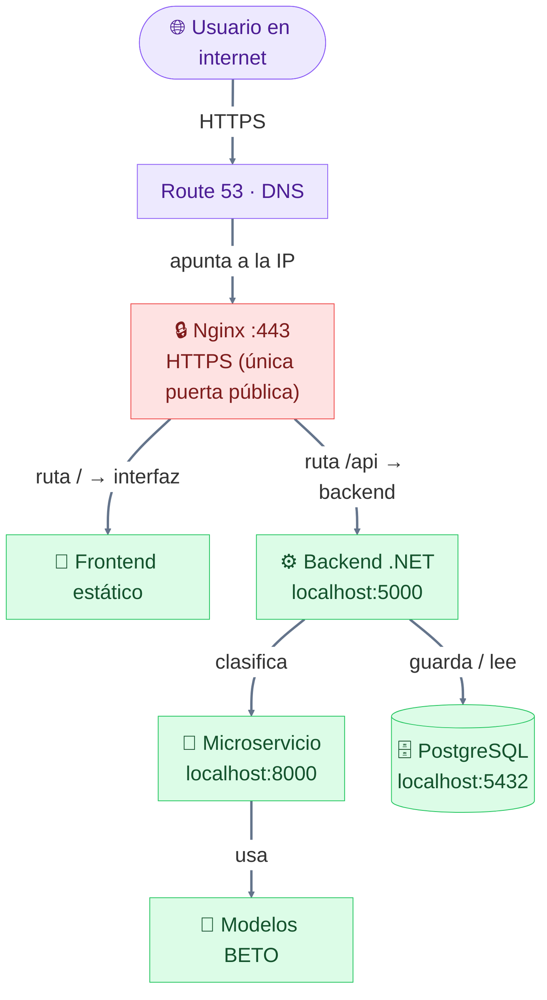

# SIREC — Sistema Inteligente de Reportes de Emergencia Ciudadana

Plataforma web que **clasifica y prioriza automáticamente** reportes ciudadanos de emergencia
(español de México) para una coordinación municipal de protección civil. Cada reporte recibe,
en el instante en que ingresa, dos etiquetas —una **categoría** (7 posibles) y un **nivel de
urgencia** (alta / media / baja)— y se presenta al operador en un panel ordenado por prioridad:
lo más peligroso aparece primero, sin importar el orden de llegada.

> Proyecto de titulación de la Maestría en IA (UNIR). Contexto y decisiones en
> [`CONTEXTO_SIREC.md`](CONTEXTO_SIREC.md); plan técnico en
> [`PLAN_SIREC_ClaudeCode_total.md`](PLAN_SIREC_ClaudeCode_total.md);
> avance en [`AVANCE_Y_TAREAS_HUMANAS.md`](AVANCE_Y_TAREAS_HUMANAS.md).

---

## En pocas palabras (sin tecnicismos)

Imagina la oficina de Protección Civil de un municipio durante una tormenta. Llegan **cientos de
mensajes** de ciudadanos al mismo tiempo: *"se metió el agua a mi casa"*, *"hay un poste con cables
en la calle"*, *"mi abuelo está atrapado en el techo"*. Hoy, una persona tiene que **leerlos uno
por uno** para decidir cuál es más urgente. Eso es lento, y en una emergencia cada minuto cuenta:
un mensaje de vida o muerte puede quedar esperando detrás de uno menor.

**SIREC es como un asistente que lee todos los mensajes en segundos y los ordena por urgencia**,
poniendo arriba lo más peligroso. Para "leer y entender" cada mensaje usa un programa de
**inteligencia artificial** (programas que aprenden a hacer una tarea a partir de ejemplos, en vez
de seguir reglas escritas a mano una por una) entrenado con reportes reales de emergencias en
México. El asistente **no decide ni despacha** la ayuda —eso lo sigue haciendo una persona—; solo
le quita la carga de leer y ordenar, para que atienda primero lo que más urge.

Este documento explica **qué es cada pieza**, **cómo se conectan** y **cómo se enseñó al sistema a
clasificar**, empezando por un glosario en español sencillo. No necesitas saber de IA para seguirlo.

---

## Índice

1. [Glosario: qué significa cada término](#1-glosario-qué-significa-cada-término)
2. [Cómo está conectado todo (arquitectura en ejecución)](#2-cómo-está-conectado-todo-arquitectura-en-ejecución)
3. [De los datos al modelo (pipeline de entrenamiento)](#3-de-los-datos-al-modelo-pipeline-de-entrenamiento)
4. [Cómo quedará desplegado en AWS](#4-cómo-quedará-desplegado-en-aws)
5. [Estructura de carpetas y archivos](#5-estructura-de-carpetas-y-archivos)
6. [Puesta en marcha en local](#6-puesta-en-marcha-en-local)
7. [Resultados del modelo](#7-resultados-del-modelo)
8. [Guía de replicación completa (reproducir de cero)](#8-guía-de-replicación-completa-para-reproducir-el-proyecto-de-cero)

---

## 1. Glosario: qué significa cada término

Cada término técnico se explica **antes** de usarlo en el resto del documento. Las definiciones
están ordenadas de lo más básico a lo más específico: cada una solo usa palabras ya explicadas
arriba. Si en las secciones siguientes aparece una palabra técnica, aquí está su significado.

### Conceptos base (leer primero)

- **Inteligencia Artificial (IA):** programas de computadora que **aprenden a hacer una tarea a
  partir de ejemplos**, en lugar de seguir reglas escritas a mano una por una.
- **Algoritmo:** una receta de pasos que la computadora sigue para resolver algo.
- **Modelo:** el "cerebro" ya entrenado que resulta de aplicar un algoritmo a muchos ejemplos.
  Recibe una entrada (aquí, un texto) y produce una respuesta (aquí, una etiqueta).
- **Entrenar (entrenamiento):** el proceso de mostrarle al modelo miles de ejemplos ya resueltos
  para que "aprenda" a resolver casos nuevos por su cuenta.
- **Vector:** una lista de números con la que la computadora representa algo (por ejemplo, un
  texto convertido a números). Las computadoras no operan con palabras, sino con números.
- **Red neuronal:** un tipo de modelo inspirado (muy a grandes rasgos) en cómo conectan las
  neuronas del cerebro; es capaz de aprender patrones complejos. Es la base de la IA moderna.

### Conceptos de datos

- **Lenguaje natural:** el idioma tal como lo escribe una persona (ej.: *"se metió el agua a mi
  casa"*), a diferencia de un formato rígido de computadora.
- **Corpus:** el conjunto de textos que usamos para entrenar y evaluar al modelo. El nuestro son
  reportes de emergencia en lenguaje natural.
- **Reporte real vs. sintético:**
  - *Real:* recolectado de fuentes públicas reales (redes sociales, prensa) y anonimizado. Son los
    que valen para medir de verdad.
  - *Sintético:* redactado/generado por nosotros para tener más ejemplos de práctica. **Solo se
    usan para entrenar, nunca para evaluar** (evaluar con datos inventados daría resultados falsos).
- **Etiquetar:** leer cada reporte y asignarle a mano su categoría y su urgencia correctas. Es lo
  que hace un humano para crear los ejemplos de los que aprende el modelo.
- **Anotador:** la persona que etiqueta los reportes.
- **Anonimizar:** quitar datos personales (nombres, teléfonos, direcciones exactas) del texto real
  antes de guardarlo.
- **Kappa de Cohen (κ):** un número de 0 a 1 que mide **cuánto coinciden dos anotadores** al
  etiquetar lo mismo por separado. Sirve para demostrar que las etiquetas son objetivas y no
  capricho de una persona. 0.70 = acuerdo "considerable"; 0.30 = acuerdo "aceptable/bajo".
- **Adjudicación:** cuando dos anotadores discrepan, una **tercera persona** decide la etiqueta
  final ("de consenso"). Así se resuelven los desacuerdos y se obtiene un conjunto confiable.
- **Conjunto de prueba:** los ejemplos que se apartan y **nunca** se usan para entrenar, solo para
  medir qué tan bien funciona el modelo con casos que no ha visto.
- **Conjunto gold ("de oro"):** nuestro conjunto de prueba, formado por los reportes con etiqueta de
  máxima confianza (doblemente etiquetados + adjudicados). Es la vara con la que medimos al modelo.
- **Desbalance de clases:** cuando unas categorías tienen muchos más ejemplos que otras (ej.:
  `dano_estructural` casi no aparece). Dificulta que el modelo aprenda las categorías raras.

### Conceptos de modelos

- **PLN (Procesamiento del Lenguaje Natural):** la rama de la IA que hace que una computadora
  "entienda" y procese texto escrito por humanos.
- **Clasificador:** un modelo que recibe un texto y devuelve una etiqueta (aquí: la categoría y la
  urgencia del reporte).
- **Baseline (línea base):** un modelo sencillo que sirve de **punto de comparación**. Si el modelo
  avanzado no le gana al baseline, no valió la pena la complejidad. El nuestro combina TF-IDF con un
  clasificador lineal (ver abajo).
- **TF-IDF:** una forma clásica de **convertir texto en vectores** contando qué palabras aparecen y
  qué tan distintivas son. No "entiende" el significado, solo cuenta palabras y letras; por eso es
  rápido y ligero.
- **Clasificador lineal:** un algoritmo que separa las clases trazando líneas rectas (fronteras)
  entre los ejemplos representados como vectores. Los dos que usamos son:
  - **SVM — Máquina de Vectores de Soporte (Support Vector Machine):** traza la frontera que mejor
    separa un grupo de otro, **dejando el mayor margen posible** entre ellos.
  - **Regresión logística:** en vez de una frontera dura, estima la **probabilidad** de que un texto
    pertenezca a cada clase.
- **Transformer:** un tipo de red neuronal moderna, base de los modelos de lenguaje actuales (la
  misma familia que ChatGPT). Su clave es el mecanismo de **"atención"**, que decide qué palabras
  del texto son más importantes para entender el resto; así **capta el contexto y el significado**.
- **BERT:** un transformer diseñado para comprender texto. A diferencia de TF-IDF, entiende que
  frases como *"no responde"* o *"sigue subiendo"* implican gravedad, aunque no contengan palabras
  obviamente "peligrosas".
- **BETO:** un BERT **entrenado específicamente en español** (`dccuchile/bert-base-spanish-wwm-cased`).
  Es nuestro **modelo principal**, el que de verdad se despliega. Al estar en español, entiende bien
  los reportes mexicanos.
- **Fine-tuning (ajuste fino):** tomar un modelo ya entrenado en general (BETO) y
  **especializarlo** en nuestra tarea concreta con nuestros ejemplos. Es mucho más barato y rápido
  que entrenar una red neuronal desde cero.
- **Class weights (pesos por clase):** un ajuste para que, durante el entrenamiento, el modelo
  preste más atención a las categorías raras, compensando el desbalance de clases.
- **GPU:** un tipo de procesador muy rápido para entrenar redes neuronales. Como no teníamos una,
  usamos **Google Colab** (un servicio gratuito que presta GPUs por internet) para entrenar BETO.

### Cómo se mide el modelo

- **Precisión:** de todo lo que el modelo dijo "esto es X", ¿qué porcentaje realmente era X?
  (mide las falsas alarmas).
- **Recall (sensibilidad):** de todo lo que de verdad era X, ¿qué porcentaje detectó el modelo?
  (mide lo que se le escapa).
- **Falso negativo:** un caso real que el modelo **NO detectó**. En emergencias es el error más
  grave (clasificar como "otro" un reporte que era "persona en riesgo"). Por eso priorizamos el recall.
- **F1:** un solo número que combina de forma balanceada la precisión y el recall.
- **Macro-F1:** el promedio del F1 de todas las clases tratándolas por igual (así las categorías
  raras también cuentan). Es nuestra métrica global principal.

### Software e infraestructura

- **HTTP:** el lenguaje con el que los programas se comunican por internet (peticiones y respuestas).
- **API REST:** la "ventanilla" de un componente: un conjunto de direcciones a las que otros
  programas mandan peticiones HTTP para pedirle algo o entregarle datos.
- **Microservicio:** un componente pequeño e independiente que hace una sola cosa (aquí: clasificar
  texto) y se comunica con el resto a través de su API. El nuestro está en Python.
- **FastAPI:** una herramienta de Python para crear APIs web rápidas. Es lo que usa el microservicio.
- **Frontend:** la parte visual con la que interactúa el usuario (las pantallas en el navegador).
- **Backend:** la parte que no se ve: recibe los datos, aplica la lógica y habla con la base de datos.
- **Base de datos / PostgreSQL:** el programa donde se guardan los reportes de forma ordenada y
  permanente. Usamos **PostgreSQL**, una base de datos gratuita y muy usada.
- **JWT (JSON Web Token):** un "pase" digital firmado que el operador obtiene al iniciar sesión y
  que demuestra, en cada petición, que tiene permiso para ver el panel.
- **Contrato de datos:** el acuerdo fijo sobre las 7 categorías, las 3 urgencias y el formato de la
  API. Debe ser idéntico en todos los componentes para que nada se rompa.
- **Docker:** una herramienta que empaqueta un programa (aquí, PostgreSQL en local) para que corra
  igual en cualquier computadora, sin instalaciones complicadas.
- **Nginx:** un programa que recibe las visitas de internet y las reparte al componente correcto;
  es la única puerta de entrada pública del sistema en producción.
- **HTTPS / Certbot:** HTTPS es la versión **cifrada y segura** de HTTP (el candado del navegador);
  **Certbot** es la herramienta que instala gratis el certificado que lo habilita.
- **systemd:** el "administrador de servicios" de Linux; mantiene cada componente encendido y lo
  reinicia solo si se cae.
- **CORS:** una regla de seguridad de los navegadores sobre qué sitios pueden llamar a una API.
  Con nuestro diseño (todo bajo el mismo Nginx) se evita el problema por completo.
- **SCP:** una forma segura de copiar archivos de una computadora a otra por la red (la usaremos
  para subir los modelos BETO a la nube, ya que son muy pesados para el repositorio).
- **EC2 / Route 53:** servicios de Amazon Web Services (AWS). **EC2** es una computadora virtual en
  la nube donde correrá todo; **Route 53** traduce el nombre del dominio (ej. `sirec.com`) a la
  dirección de esa computadora.
- **Migración (de base de datos):** un archivo que registra un cambio en la estructura de la base de
  datos (crear una tabla, agregar una columna), para poder reconstruirla en cualquier máquina.

---

## 2. Cómo está conectado todo (arquitectura en ejecución)

Qué pasa cuando un ciudadano manda un reporte y cuando el operador revisa el panel:



**El flujo, paso a paso:**
1. El ciudadano escribe un reporte en el **formulario público** (sin registro).
2. El **frontend React** lo envía al **backend .NET**.
3. El backend llama al **microservicio Python**, que pasa el texto por **BETO** y devuelve
   categoría + urgencia + confianzas.
4. El backend **guarda** el reporte ya clasificado en **PostgreSQL**.
5. El **operador** entra al **panel** (con login/JWT) y ve los reportes **ordenados por urgencia**:
   lo crítico primero.

> **Resiliencia:** si el microservicio no responde, el backend guarda el reporte con una
> clasificación de respaldo, para no perder ningún aviso.
>
> **Modo simulado vs. modelo:** el microservicio puede arrancar en modo *simulado* (reglas por
> palabras clave, sin IA — útil para desarrollo) o en modo *modelo* (BETO real). El contrato de la
> API es idéntico en ambos, así que el resto del sistema no nota la diferencia.

---

## 3. De los datos al modelo (pipeline de entrenamiento)

Cómo se construyó y evaluó el clasificador, desde los reportes hasta el modelo servido:



**Idea clave:** el conjunto **gold** (180 reportes validados por consenso humano) se aparta como
**prueba**; el resto de reales + los sintéticos se usan para **entrenar**. Así medimos al modelo
contra etiquetas de máxima confianza y sin hacer trampa (no evaluamos con lo que entrenó).

---

## 4. Cómo quedará desplegado en AWS

Todo corre en **una sola instancia EC2** (decisión de arquitectura: sin S3, sin CloudFront, sin
Docker en producción). Nginx es la única puerta al internet; los demás servicios solo escuchan en
`localhost`.



> Todo lo que está bajo `localhost` (backend, microservicio, PostgreSQL) corre en la misma EC2 bajo
> **systemd** y **no** es accesible desde internet: solo Nginx con HTTPS al frente.

**Ventajas de este diseño:** como todo va por Nginx en el **mismo origen** (la misma dirección web),
no hay problemas de CORS ni de contenido mixto (mezclar tráfico seguro e inseguro en la misma
página). **Seguridad:** PostgreSQL (5432), el microservicio (8000) y el backend directo (5000)
**nunca** se exponen a internet; solo Nginx con HTTPS al frente. Los modelos BETO
(~440 MB c/u) no caben en Git, así que se copian a la EC2 por SCP — ver
[`microservicio-ml/DESPLIEGUE_MODELO.md`](microservicio-ml/DESPLIEGUE_MODELO.md) y el plan completo
en [`PLAN_SIREC_AWS_Despliegue.md`](PLAN_SIREC_AWS_Despliegue.md).

---

## 5. Estructura de carpetas y archivos

### Raíz del proyecto

| Archivo | Qué es |
|---|---|
| `README.md` | Este documento. |
| `CONTEXTO_SIREC.md` | Contexto maestro: qué es SIREC, decisiones acordadas, requisitos del evaluador. |
| `PLAN_SIREC_ClaudeCode_total.md` | Plan técnico de implementación (contrato, fases, checkpoints). |
| `PLAN_SIREC_AWS_Despliegue.md` | Plan de despliegue en AWS (EC2 + Route 53). |
| `PLAN_SIREC_tareas_humanas.md` | Tareas del equipo que no puede hacer la IA. |
| `AVANCE_Y_TAREAS_HUMANAS.md` | Bitácora de avance y estado de cada fase. |
| `.gitignore` | Qué archivos NO se versionan (modelos pesados, videos, dependencias). |

### `microservicio-ml/` — El clasificador (Python / FastAPI) · puerto 8000

Recibe un texto y devuelve categoría + urgencia. Es el que sirve a **BETO**.

| Archivo | Qué es |
|---|---|
| `main.py` | La API FastAPI: expone `POST /clasificar` y `GET /salud`. Elige modo simulado o modelo. |
| `contrato.py` | Las 7 categorías y 3 urgencias fijas (fuente de verdad del microservicio). |
| `clasificador_simulado.py` | Clasificación por **reglas de palabras clave** (modo de desarrollo, sin IA). |
| `clasificador_modelo.py` | Clasificación real con **BETO** (carga los modelos y devuelve confianzas). |
| `test_main.py` | Pruebas automáticas (pytest) de la API. |
| `requirements.txt` | Dependencias Python (FastAPI, y torch/transformers para modo modelo). |
| `DESPLIEGUE_MODELO.md` | Cómo instalar/copiar los modelos BETO en local y en la EC2. |
| `modelos/` | **(no en Git)** Los modelos BETO entrenados: `beto_categoria/` y `beto_urgencia/`. |
| `README.md` | Detalle del microservicio. |

### `backend-api/` — El cerebro central (.NET 8 / C#) · puerto 5000

El backend, construido con **.NET** (una plataforma de programación de Microsoft) en el lenguaje
**C#**. Recibe los reportes, llama al microservicio, los guarda en PostgreSQL y sirve el panel con login.

| Archivo | Qué es |
|---|---|
| `Program.cs` | Arranque de la app, configuración de servicios, CORS y JWT. |
| `Controllers/ReportesController.cs` | Rutas de la API para reportes (crear público, listar priorizado). |
| `Controllers/AuthController.cs` | Login del operador y emisión del "pase" JWT. |
| `Services/ClasificadorClient.cs` | Cliente HTTP que llama al microservicio Python (con respaldo si falla). |
| `Auth/JwtService.cs` | Generación y validación de los pases JWT. |
| `Data/SirecDbContext.cs` | Acceso a la base de datos (mediante Entity Framework Core, una librería que traduce entre el código y las tablas). |
| `Models/Reporte.cs`, `Models/Contrato.cs` | El modelo de datos y las categorías/urgencias. |
| `Dtos/` | Objetos de entrada/salida de la API (reportes y autenticación). |
| `Migrations/` | Historial de cambios del esquema de la base de datos. |
| `appsettings*.json` | Configuración (cadena de conexión, claves). Producción fuera del repo. |
| `SirecApi.csproj`, `global.json` | Proyecto y versión de .NET. |
| `README.md` | Detalle del backend. |

### `frontend/` — La interfaz (React / Vite) · puerto 5173

La parte visual que se ve en el navegador. Construida con **React** (una herramienta para crear
interfaces web) y **Vite** (la herramienta que la empaqueta y la sirve durante el desarrollo).
Tiene dos vistas: el formulario público y el panel del operador.

| Archivo | Qué es |
|---|---|
| `src/main.jsx` | Punto de entrada de la app React. |
| `src/pages/FormularioPublico.jsx` | Formulario donde el ciudadano envía su reporte. |
| `src/pages/Panel.jsx` | Panel del operador con los reportes ordenados por urgencia. |
| `src/api.js` | Funciones que llaman a la API del backend. |
| `src/contrato.js` | Copia del contrato (categorías/urgencias) para el frontend. |
| `src/util.js`, `src/index.css` | Utilidades y estilos. |
| `index.html`, `vite.config.js`, `package.json` | Configuración del proyecto y dependencias. |
| `.env.example` | Plantilla de variables de entorno (ej. URL del backend). |
| `dist/` | Versión final compilada de la interfaz: archivos estáticos (HTML, CSS, imágenes que no cambian) que servirá Nginx en producción. |
| `README.md` | Detalle del frontend. |

### `datos-modelo/` — Corpus, etiquetado y entrenamiento

Todo lo relacionado con los datos y el modelo. **El corazón académico del proyecto.**

**Guía y herramienta de etiquetado:**
| Archivo | Qué es |
|---|---|
| `guia_etiquetado.md` | La guía formal: 7 categorías, criterio de urgencia, casos de frontera. |
| `herramienta_etiquetado.py` | App web local para etiquetar reportes (teclas 1-7 / A-M-B). |
| `INSTRUCCIONES_RICARDO.md`, `INSTRUCCIONES_NAHUM.md`, `INSTRUCCIONES_KAPPA.md` | Instructivos enviados al equipo (traza del proceso). |
| `EJEMPLOS_reportes.csv` | 21 ejemplos anonimizados como molde de estilo. |

**Corpus (los datos):**
| Archivo | Qué es |
|---|---|
| `corpus_etiquetado.csv` | **400 reportes reales** etiquetados (Ricardo + Nahum). |
| `corpus_sintetico.csv` | 900 reportes sintéticos (solo para entrenar). |
| `generar_corpus_sintetico.py` | Script que generó los sintéticos. |
| `reportes_kappa.csv` | 180 reportes (muestra) para el doble etiquetado. |
| `kappa_ricardo.csv`, `kappa_nahum.csv` | El mismo set etiquetado por cada uno por separado. |
| `adjudicacion_kappa.csv` | Archivo donde el 3er anotador resolvió los desacuerdos. |
| `gold_kappa.csv` | ⭐ Los 180 con etiqueta de consenso = **conjunto de prueba**. |

**Scripts de análisis y entrenamiento:**
| Archivo | Qué es |
|---|---|
| `calcular_kappa.py` | Calcula el kappa de Cohen entre los dos anotadores. |
| `generar_adjudicacion.py` | Arma el archivo de adjudicación (solo celdas en desacuerdo). |
| `consolidar_adjudicacion.py` | Convierte la adjudicación en el conjunto gold. |
| `generar_reporte_corpus.py` | Genera la tabla de trazabilidad del corpus. |
| `entrenar_baseline.py` | Entrena el **baseline** (TF-IDF + SVM / regresión logística). |
| `optimizar_umbral_alta.py` | Ajusta el umbral (el punto de corte a partir del cual se decide "es urgencia alta") para no perder casos `alta`. |
| `entrenar_beto_colab.ipynb` | Cuaderno de **fine-tuning de BETO** para Google Colab (GPU). |
| `requirements-modelo.txt` | Dependencias para entrenar (scikit-learn, torch, transformers). |

**Reportes de resultados (para la memoria):**
| Archivo | Qué es |
|---|---|
| `reporte_corpus.md` | Trazabilidad: % real vs sintético + distribución por clase. |
| `reporte_kappa.md` | Resultado del kappa y del proceso de adjudicación. |
| `resultados_baseline.md` | Métricas del baseline sobre el conjunto gold. |
| `comparacion_modelos.md` | ⭐ **Baseline vs BETO** — la tabla clave del proyecto. |
| `README.md` | Índice de la fase de datos. |

### `entregas/` — Documentos oficiales

Entregas al profesor y su retroalimentación. Convención: `<Nombre>.pdf` = entrega del equipo;
`<Nombre> comentarios.txt` = comentarios del profesor. Incluye el instrumento de empatía
(Google Form) y sus respuestas (anónimas).

### `Imagenes/` y `videos/`

Material de la Entrega 2 (Design Thinking): capturas y el video de la sesión (el `.mp4`
no se versiona por tamaño; sí su transcripción y scripts).

---

## 6. Puesta en marcha en local

Requisitos: **.NET 8 SDK**, **Node.js 20+**, **Python 3.11+** (probado en 3.13), **Docker**, **Git**.

```powershell
# 1) Clonar
git clone https://github.com/alexisherrera22/sirec.git
cd sirec

# 2) Base de datos (PostgreSQL en Docker)
#    Si el puerto 5432 está ocupado, este proyecto usa 5433 en local (ver backend-api/README.md)
docker run --name sirec-db -e POSTGRES_PASSWORD=sirec -e POSTGRES_DB=sirec -p 5433:5432 -d postgres:16

# 3) Microservicio (Python)
cd microservicio-ml
py -m pip install -r requirements.txt
py -m uvicorn main:app --port 8000
#   (déjalo corriendo; abre otra terminal para lo siguiente)
```

Para usar **BETO real** en vez del modo simulado: coloca los modelos en `microservicio-ml/modelos/`
(ver `DESPLIEGUE_MODELO.md`) y arranca con la variable de entorno:

```powershell
$env:SIREC_MODO = "modelo"
py -m uvicorn main:app --port 8000
```

```powershell
# 4) Backend (.NET) — aplica migraciones y corre
cd ..\backend-api
dotnet run

# 5) Frontend (React)
cd ..\frontend
npm install
npm run dev
```

Luego abre http://localhost:5173 (formulario) y http://localhost:5173/panel
(panel; usuario `operador` / `sirec-local` en desarrollo).

> Las carpetas `node_modules/`, `.venv/`, `bin/`, `obj/` y `modelos/` **no** están en el repositorio
> a propósito: se regeneran con los comandos de arriba (o se copian, en el caso de los modelos).

---

## 7. Resultados del modelo

Evaluación sobre el conjunto **gold** (180 reportes reales, validados por consenso humano).
**BETO supera al baseline en todas las métricas**, sobre todo en el recall de las clases críticas
(que es lo que más importa en emergencias: no perder casos graves).

| Tarea | Métrica | Baseline (TF-IDF+SVM/LogReg) | **BETO** |
|---|---|---:|---:|
| Categoría | Macro-F1 | 0.65 | **0.74** |
| Categoría | Recall `persona_en_riesgo` | 0.58 (19 se escapan) | **0.87 (solo 6)** |
| Urgencia | Macro-F1 | 0.45 | **0.55** |
| Urgencia | Recall `alta` | 0.58 (20 se escapan) | **0.77 (solo 11)** |

Detalle completo en [`datos-modelo/comparacion_modelos.md`](datos-modelo/comparacion_modelos.md).
El acuerdo humano (kappa) fue de **0.70 en categoría** y **0.31 en urgencia** (esta última se
resolvió con adjudicación) — ver [`datos-modelo/reporte_kappa.md`](datos-modelo/reporte_kappa.md).

---

## 8. Guía de replicación completa (para reproducir el proyecto de cero)

Esta sección describe **literalmente todo lo que ocupamos, qué hicimos, cómo entrenamos y qué
instalamos**, con versiones y comandos exactos, para que cualquier persona pueda reproducirlo.

### 8.1 Todo lo que ocupamos (stack y versiones reales)

| Herramienta | Versión usada | Para qué |
|---|---|---|
| **Python** | 3.13.14 | El microservicio y todo el modelado (etiquetado, baseline, BETO). |
| **scikit-learn** | 1.9.0 | El baseline clásico (TF-IDF + SVM / regresión logística) y las métricas. |
| **pandas** | 3.0.3 | Leer y manipular los CSV del corpus. |
| **numpy** | 2.5.1 | Cálculos numéricos de apoyo. |
| **PyTorch (torch)** | 2.13.0+cpu | Motor de redes neuronales que ejecuta BETO. En local basta la versión CPU. |
| **transformers** (Hugging Face) | 5.13.1 | Descargar y hacer fine-tuning de BETO. |
| **datasets, accelerate** | 2.19+ / 0.30+ | Apoyo al entrenamiento de BETO (manejo de datos y aceleración). |
| **FastAPI** | 0.139.0 | Crear la API del microservicio de clasificación. |
| **uvicorn** | 0.51.0 | Servidor que corre la API de FastAPI. |
| **.NET SDK** | 8 (probado con 8 y 10) | El backend (API REST, base de datos, login). |
| **Node.js** | 20+ (usamos 22.23.1) | Construir y correr el frontend React. |
| **Docker** | 29.5.2 | Levantar PostgreSQL en local sin instalarlo a mano. |
| **PostgreSQL** | 16 | La base de datos donde se guardan los reportes. |
| **Google Colab** | GPU T4 (gratuita) | Entrenar BETO, porque no teníamos GPU propia. |
| **BETO** | `dccuchile/bert-base-spanish-wwm-cased` | El modelo de lenguaje en español que clasifica. |
| **Git / GitHub** | — | Control de versiones del código (repositorio `sirec`). |

Todo es **gratuito y de código abierto**. Costo por predicción del modelo: cero (no se usa ninguna
API de pago).

### 8.2 Qué instalamos (comandos exactos)

```powershell
# --- Para el microservicio y usar BETO ya entrenado (en local, CPU) ---
cd microservicio-ml
py -m pip install fastapi "uvicorn[standard]" torch transformers

# --- Para entrenar el baseline clásico (D4) en local (CPU) ---
cd ../datos-modelo
py -m pip install scikit-learn pandas numpy

# --- Para entrenar BETO (D5): se instala DENTRO de Google Colab, no en local ---
# (primera celda del cuaderno entrenar_beto_colab.ipynb)
#   !pip install "transformers>=4.40" "datasets>=2.19" "accelerate>=0.30" scikit-learn pandas
```

> Nota: `calcular_kappa.py` **no necesita instalar nada** (usa solo la librería estándar de Python).

### 8.3 Qué hicimos con los datos (paso a paso)

1. **Guía de etiquetado** (`guia_etiquetado.md`): definimos las 7 categorías, los 3 niveles de
   urgencia, los casos de frontera y la regla de desempate (si hay una persona en peligro, gana
   `persona_en_riesgo`). Un humano la aprobó (no la IA).
2. **Recolección real:** dos personas del equipo (Ricardo y Nahum) juntaron **200 reportes reales
   cada una** de fuentes públicas de contingencias en Veracruz, y los **anonimizaron** (quitar
   nombres, teléfonos, direcciones). Total: **400 reportes reales** → `corpus_etiquetado.csv`.
3. **Etiquetado:** cada quien clasificó sus reportes con la herramienta local
   `herramienta_etiquetado.py` (una app web con teclas 1-7 para categoría y A/M/B para urgencia).
4. **Corpus sintético:** generamos **900 reportes sintéticos** con `generar_corpus_sintetico.py`
   (`corpus_sintetico.csv`), declarados como tales. **Solo se usan para entrenar.**
5. **Doble etiquetado (kappa):** apartamos una muestra de **180 reportes** (`reportes_kappa.csv`) y
   Ricardo y Nahum la etiquetaron **por separado, sin verse** → `kappa_ricardo.csv`, `kappa_nahum.csv`.
6. **Kappa de Cohen** (`calcular_kappa.py`): medimos el acuerdo → **categoría κ = 0.70**
   (considerable) y **urgencia κ = 0.31** (baja, la urgencia es más subjetiva).
7. **Adjudicación:** como la urgencia salió baja, una **tercera persona** resolvió los 114
   desacuerdos (`generar_adjudicacion.py` → `adjudicacion_kappa.csv` → `consolidar_adjudicacion.py`),
   produciendo el conjunto **gold** de 180 reportes de consenso (`gold_kappa.csv`).
8. **División de datos (sin trampa):** los **180 gold** se apartan como **conjunto de prueba**; los
   **220 reales restantes + los 900 sintéticos** se usan para **entrenar**. Los 180 de prueba nunca
   se usan para entrenar (evita evaluar con lo que el modelo ya vio).

### 8.4 Cómo entrenamos el baseline (modelo clásico, en local)

El baseline convierte el texto en números con **TF-IDF** (cuenta palabras y grupos de letras) y lo
clasifica con **SVM** o **regresión logística**. Corre en CPU en segundos.

```powershell
cd datos-modelo
# Entrena y evalúa contra el conjunto gold (train = 220 reales + 900 sintéticos)
py entrenar_baseline.py --gold-test --con-sintetico

# Extra: ajustar el umbral para no perder urgencias "alta" (prioriza recall)
py optimizar_umbral_alta.py --gold-test
```

Detalles técnicos: TF-IDF de palabra (1-2) + de carácter (3-5); `class_weight="balanced"` por el
desbalance; semilla fija 42. **Resultado:** categoría macro-F1 0.65, urgencia macro-F1 0.45.

### 8.5 Cómo entrenamos BETO (en Google Colab con GPU)

BETO es una red neuronal grande; entrenarla necesita una **GPU**. Como no teníamos, usamos
**Google Colab** (gratis). Todo está en el cuaderno `datos-modelo/entrenar_beto_colab.ipynb`.

Pasos exactos:
1. Entrar a [colab.research.google.com](https://colab.research.google.com) → *Subir cuaderno* →
   subir `entrenar_beto_colab.ipynb`.
2. Menú *Entorno de ejecución → Cambiar tipo de entorno → GPU (T4)*.
3. Ejecutar las celdas en orden. En la celda de datos, subir 3 archivos:
   `corpus_etiquetado.csv`, `corpus_sintetico.csv`, `gold_kappa.csv`.
4. Las celdas de entrenamiento ajustan BETO para **categoría** y para **urgencia** (un modelo cada una).
5. La última celda guarda los modelos en tu Google Drive (`beto_modelos.zip`).

Parámetros de entrenamiento (fine-tuning): 4 épocas, tamaño de lote 16, tasa de aprendizaje `2e-5`,
longitud máxima 128 tokens, **pesos por clase** por el desbalance, y se elige el mejor modelo por
**recall de la clase crítica**. **Resultado:** categoría macro-F1 0.74, urgencia macro-F1 0.55.

Equivalente por línea de comandos (si se tiene GPU local): el mismo pipeline vive en el cuaderno;
la lógica es idéntica a la del baseline pero con BETO.

### 8.6 Cómo integramos el modelo entrenado al sistema

1. Descargar `beto_modelos.zip` desde Google Drive.
2. Extraer **solo los archivos finales** (sin los checkpoints de entrenamiento) en
   `microservicio-ml/modelos/`, quedando `modelos/beto_categoria/` y `modelos/beto_urgencia/`.
3. Arrancar el microservicio en **modo modelo**:
   ```powershell
   cd microservicio-ml
   $env:SIREC_MODO = "modelo"
   py -m uvicorn main:app --port 8000
   ```
4. Probar:
   ```powershell
   curl.exe -X POST http://localhost:8000/clasificar -H "Content-Type: application/json" -d "{\"texto\":\"Hay una persona atrapada, el agua sigue subiendo\"}"
   # -> {"categoria":"persona_en_riesgo","urgencia":"alta", ...}
   ```

El microservicio carga los modelos con `clasificador_modelo.py` y responde con el mismo formato que
el modo simulado, así que el backend .NET no nota el cambio. Para desplegarlo en AWS, los modelos se
copian a la EC2 por SCP (ver [`microservicio-ml/DESPLIEGUE_MODELO.md`](microservicio-ml/DESPLIEGUE_MODELO.md)).

### 8.7 Orden completo para replicar desde cero

```text
1. Clonar el repositorio.
2. Instalar dependencias (§8.2).
3. Levantar PostgreSQL con Docker, backend .NET y frontend React (§6).
4. (Datos) Etiquetar reportes reales + generar sintéticos (§8.3, pasos 1-4).
5. (Validez) Doble etiquetado + kappa + adjudicación → gold_kappa.csv (§8.3, pasos 5-8).
6. (Baseline) py entrenar_baseline.py --gold-test --con-sintetico (§8.4).
7. (BETO) Entrenar en Colab con entrenar_beto_colab.ipynb → beto_modelos.zip (§8.5).
8. (Integrar) Extraer modelos en microservicio-ml/modelos/ y arrancar en modo modelo (§8.6).
9. (Comparar) Revisar comparacion_modelos.md: BETO gana al baseline.
```

Con esto, cualquier persona con los mismos datos y herramientas obtiene el mismo sistema y
resultados equivalentes (usamos semillas fijas donde aplica, semilla 42).
