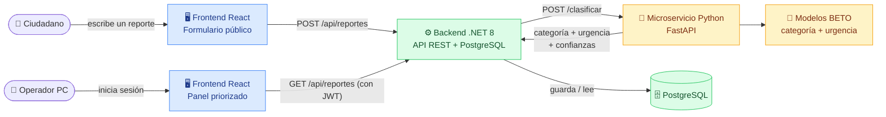
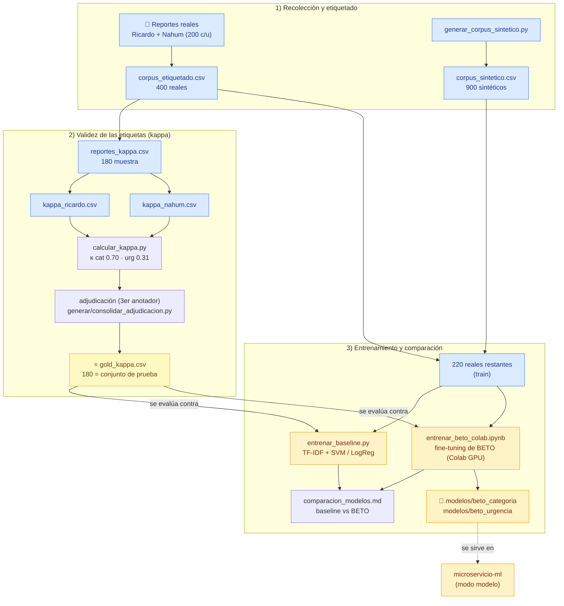
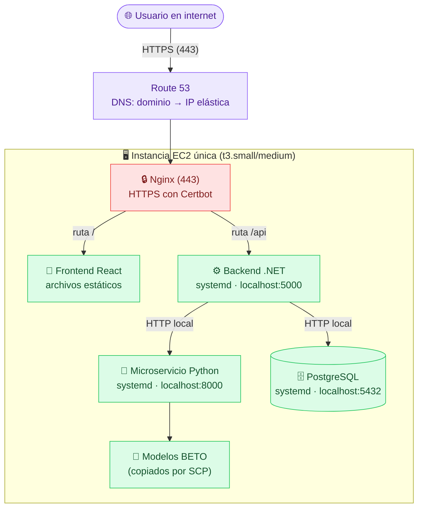

# SIREC — Sistema Inteligente de Reportes de Emergencia Ciudadana

Plataforma web que **clasifica y prioriza automáticamente** reportes ciudadanos de emergencia
(español de México) para una coordinación municipal de protección civil. Cada reporte recibe,
en el instante en que ingresa, dos etiquetas —una **categoría** (7 posibles) y un **nivel de
urgencia** (alta / media / baja)— y se presenta al operador en un panel ordenado por prioridad:
lo más peligroso aparece primero, sin importar el orden de llegada.

> Proyecto de titulación de la Maestría en IA (UNIR). Contexto y decisiones en
> [`CONTEXTO_SIREC.md`](CONTEXTO_SIREC.md); plan técnico en
> [`PLAN_SIREC_ClaudeCode_total.md`](PLAN_SIREC_ClaudeCode_total.md);
> avance en [`AVANCE_Y_TAREAS_HUMANAS.md`](AVANCE_Y_TAREAS_HUMANAS.md).

---

## En pocas palabras (sin tecnicismos)

Imagina la oficina de Protección Civil de un municipio durante una tormenta. Llegan **cientos de
mensajes** de ciudadanos al mismo tiempo: *"se metió el agua a mi casa"*, *"hay un poste con cables
en la calle"*, *"mi abuelo está atrapado en el techo"*. Hoy, una persona tiene que **leerlos uno
por uno** para decidir cuál es más urgente. Eso es lento, y en una emergencia cada minuto cuenta:
un mensaje de vida o muerte puede quedar esperando detrás de uno menor.

**SIREC es como un asistente que lee todos los mensajes en segundos y los ordena por urgencia**,
poniendo arriba lo más peligroso. Para "leer y entender" cada mensaje usa un programa de
inteligencia artificial entrenado con ejemplos reales de emergencias en México. El asistente **no
decide ni despacha** la ayuda —eso lo sigue haciendo una persona—; solo le quita la carga de leer y
ordenar, para que atienda primero lo que más urge.

Este documento explica **qué es cada pieza**, **cómo se conectan** y **cómo se enseñó al sistema a
clasificar**, empezando por un glosario en español sencillo. No necesitas saber de IA para seguirlo.

---

## Índice

1. [Glosario: qué significa cada término](#1-glosario-qué-significa-cada-término)
2. [Cómo está conectado todo (arquitectura en ejecución)](#2-cómo-está-conectado-todo-arquitectura-en-ejecución)
3. [De los datos al modelo (pipeline de entrenamiento)](#3-de-los-datos-al-modelo-pipeline-de-entrenamiento)
4. [Cómo quedará desplegado en AWS](#4-cómo-quedará-desplegado-en-aws)
5. [Estructura de carpetas y archivos](#5-estructura-de-carpetas-y-archivos)
6. [Puesta en marcha en local](#6-puesta-en-marcha-en-local)
7. [Resultados del modelo](#7-resultados-del-modelo)

---

## 1. Glosario: qué significa cada término

Explicaciones en lenguaje sencillo de todo lo que usamos.

### Conceptos de datos

- **Corpus:** el conjunto de textos que usamos para enseñar y evaluar al modelo. El nuestro son
  reportes de emergencia escritos en lenguaje natural (ej.: *"se metió el agua a mi casa"*).
- **Reporte real vs. sintético:**
  - *Real:* recolectado de fuentes públicas reales (redes, prensa) y anonimizado. Son los que
    valen para medir de verdad.
  - *Sintético:* generado por nosotros para tener más ejemplos de práctica. **Solo se usan para
    entrenar, nunca para evaluar** (evaluar con datos inventados daría métricas falsas).
- **Etiquetar:** leer cada reporte y asignarle a mano su categoría y su urgencia correctas. Es lo
  que hace un humano para crear los ejemplos de los que aprende el modelo.
- **Anonimizar:** quitar datos personales (nombres, teléfonos, direcciones exactas) del texto real
  antes de guardarlo.
- **Kappa de Cohen (κ):** un número de 0 a 1 que mide **cuánto coinciden dos personas** etiquetando
  lo mismo por separado. Sirve para demostrar que las etiquetas son objetivas y no capricho de una
  persona. 0.70 = acuerdo "considerable"; 0.30 = acuerdo "aceptable/bajo".
- **Adjudicación:** cuando dos anotadores discrepan, una **tercera persona** decide la etiqueta
  final ("de consenso"). Así se resuelven los desacuerdos y se obtiene un conjunto confiable.
- **Conjunto gold ("de oro"):** los reportes con etiqueta de máxima confianza (doblemente
  etiquetados + adjudicados). Es nuestro **conjunto de prueba**: la vara con la que medimos al modelo.
- **Desbalance de clases:** cuando unas categorías tienen muchos más ejemplos que otras (ej.:
  `dano_estructural` casi no aparece). Dificulta el aprendizaje de las clases raras.

### Conceptos de modelos

- **PLN (Procesamiento del Lenguaje Natural):** la rama de la IA que hace que una computadora
  "entienda" texto humano.
- **Clasificador:** un modelo que recibe un texto y devuelve una etiqueta (aquí: la categoría y la
  urgencia).
- **Baseline (línea base):** un modelo sencillo que sirve de **punto de comparación**. Si el modelo
  avanzado no le gana al baseline, no vale la pena. El nuestro es TF-IDF + un clasificador lineal.
- **TF-IDF:** una forma clásica de convertir texto en números contando qué palabras aparecen y qué
  tan distintivas son. No "entiende" el significado, solo cuenta palabras/letras. Rápido y ligero.
- **SVM — Máquina de Vectores de Soporte (Support Vector Machine):** un algoritmo clásico de
  clasificación. Imagina que dibuja la "línea" (frontera) que mejor separa unos ejemplos de otros,
  dejando el mayor margen posible entre grupos. Con TF-IDF forma nuestro baseline.
- **Regresión logística:** otro clasificador lineal clásico; en vez de una frontera dura, estima la
  **probabilidad** de que un texto sea de cada clase. También parte del baseline.
- **BERT:** un tipo de red neuronal moderna ("transformer") que **sí capta el significado y el
  contexto** de las palabras, no solo su presencia. Entiende que "no responde" o "sigue subiendo"
  implican gravedad.
- **Transformer:** la arquitectura de red neuronal detrás de los modelos de lenguaje modernos
  (la misma familia que ChatGPT). Su clave es el mecanismo de "atención", que pesa qué palabras
  del texto importan más para entender el resto.
- **BETO:** un BERT **entrenado específicamente en español** (`dccuchile/bert-base-spanish-wwm-cased`).
  Es nuestro modelo principal, el que de verdad se despliega. Al estar en español, entiende bien los
  reportes mexicanos.
- **Fine-tuning (ajuste fino):** tomar un modelo ya entrenado en general (BETO) y **especializarlo**
  en nuestra tarea concreta con nuestros ejemplos. Es mucho más barato que entrenar desde cero.
- **Class weights (pesos por clase):** un truco para que el modelo preste más atención a las clases
  raras durante el entrenamiento, compensando el desbalance.

### Cómo se mide el modelo

- **Precisión:** de lo que el modelo dijo "es X", ¿qué porcentaje realmente era X? (mide falsas alarmas).
- **Recall (sensibilidad):** de todo lo que de verdad era X, ¿qué porcentaje detectó el modelo?
  (mide lo que se le escapa).
- **Falso negativo:** un caso real que el modelo **NO detectó**. En emergencias es el error más
  grave (una "persona en riesgo" clasificada como "otro"). Por eso priorizamos el recall.
- **F1:** una combinación balanceada de precisión y recall en un solo número.
- **Macro-F1:** el promedio del F1 de todas las clases, tratándolas por igual (así las clases raras
  también cuentan). Es nuestra métrica global principal.

### Conceptos de software

- **Microservicio:** un componente pequeño e independiente que hace una sola cosa (aquí: clasificar
  texto) y se comunica con el resto por la red. El nuestro está en Python con **FastAPI**.
- **FastAPI:** un framework de Python para crear APIs web rápidas.
- **API REST:** la forma en que los componentes se hablan entre sí por HTTP (peticiones y respuestas).
- **JWT (JSON Web Token):** un "pase" firmado que el operador obtiene al hacer login y que
  demuestra, en cada petición, que tiene permiso para ver el panel.
- **Contrato de datos:** el acuerdo fijo sobre las 7 categorías, las 3 urgencias y el formato de la
  API. Debe ser idéntico en todos los componentes (Python, .NET, React) para que nada se rompa.

---

## 2. Cómo está conectado todo (arquitectura en ejecución)

Qué pasa cuando un ciudadano manda un reporte y cuando el operador revisa el panel:



**El flujo, paso a paso:**
1. El ciudadano escribe un reporte en el **formulario público** (sin registro).
2. El **frontend React** lo envía al **backend .NET**.
3. El backend llama al **microservicio Python**, que pasa el texto por **BETO** y devuelve
   categoría + urgencia + confianzas.
4. El backend **guarda** el reporte ya clasificado en **PostgreSQL**.
5. El **operador** entra al **panel** (con login/JWT) y ve los reportes **ordenados por urgencia**:
   lo crítico primero.

> **Resiliencia:** si el microservicio no responde, el backend guarda el reporte con una
> clasificación de respaldo, para no perder ningún aviso.
>
> **Modo simulado vs. modelo:** el microservicio puede arrancar en modo *simulado* (reglas por
> palabras clave, sin IA — útil para desarrollo) o en modo *modelo* (BETO real). El contrato de la
> API es idéntico en ambos, así que el resto del sistema no nota la diferencia.

---

## 3. De los datos al modelo (pipeline de entrenamiento)

Cómo se construyó y evaluó el clasificador, desde los reportes hasta el modelo servido:



**Idea clave:** el conjunto **gold** (180 reportes validados por consenso humano) se aparta como
**prueba**; el resto de reales + los sintéticos se usan para **entrenar**. Así medimos al modelo
contra etiquetas de máxima confianza y sin hacer trampa (no evaluamos con lo que entrenó).

---

## 4. Cómo quedará desplegado en AWS

Todo corre en **una sola instancia EC2** (decisión de arquitectura: sin S3, sin CloudFront, sin
Docker en producción). Nginx es la única puerta al internet; los demás servicios solo escuchan en
`localhost`.



**Ventajas de este diseño:** como todo va por Nginx en el **mismo origen**, no hay problemas de
CORS ni de contenido mixto. **Seguridad:** PostgreSQL (5432), el microservicio (8000) y el backend
directo (5000) **nunca** se exponen a internet; solo Nginx con HTTPS al frente. Los modelos BETO
(~440 MB c/u) no caben en Git, así que se copian a la EC2 por SCP — ver
[`microservicio-ml/DESPLIEGUE_MODELO.md`](microservicio-ml/DESPLIEGUE_MODELO.md) y el plan completo
en [`PLAN_SIREC_AWS_Despliegue.md`](PLAN_SIREC_AWS_Despliegue.md).

---

## 5. Estructura de carpetas y archivos

### Raíz del proyecto

| Archivo | Qué es |
|---|---|
| `README.md` | Este documento. |
| `CONTEXTO_SIREC.md` | Contexto maestro: qué es SIREC, decisiones acordadas, requisitos del evaluador. |
| `PLAN_SIREC_ClaudeCode_total.md` | Plan técnico de implementación (contrato, fases, checkpoints). |
| `PLAN_SIREC_AWS_Despliegue.md` | Plan de despliegue en AWS (EC2 + Route 53). |
| `PLAN_SIREC_tareas_humanas.md` | Tareas del equipo que no puede hacer la IA. |
| `AVANCE_Y_TAREAS_HUMANAS.md` | Bitácora de avance y estado de cada fase. |
| `.gitignore` | Qué archivos NO se versionan (modelos pesados, videos, dependencias). |

### `microservicio-ml/` — El clasificador (Python / FastAPI) · puerto 8000

Recibe un texto y devuelve categoría + urgencia. Es el que sirve a **BETO**.

| Archivo | Qué es |
|---|---|
| `main.py` | La API FastAPI: expone `POST /clasificar` y `GET /salud`. Elige modo simulado o modelo. |
| `contrato.py` | Las 7 categorías y 3 urgencias fijas (fuente de verdad del microservicio). |
| `clasificador_simulado.py` | Clasificación por **reglas de palabras clave** (modo de desarrollo, sin IA). |
| `clasificador_modelo.py` | Clasificación real con **BETO** (carga los modelos y devuelve confianzas). |
| `test_main.py` | Pruebas automáticas (pytest) de la API. |
| `requirements.txt` | Dependencias Python (FastAPI, y torch/transformers para modo modelo). |
| `DESPLIEGUE_MODELO.md` | Cómo instalar/copiar los modelos BETO en local y en la EC2. |
| `modelos/` | **(no en Git)** Los modelos BETO entrenados: `beto_categoria/` y `beto_urgencia/`. |
| `README.md` | Detalle del microservicio. |

### `backend-api/` — El cerebro central (.NET 8 / C#) · puerto 5000

Recibe los reportes, llama al microservicio, los guarda en PostgreSQL y sirve el panel con login.

| Archivo | Qué es |
|---|---|
| `Program.cs` | Arranque de la app, configuración de servicios, CORS y JWT. |
| `Controllers/ReportesController.cs` | Endpoints de reportes (crear público, listar priorizado). |
| `Controllers/AuthController.cs` | Login del operador y emisión del JWT. |
| `Services/ClasificadorClient.cs` | Cliente HTTP que llama al microservicio Python (con respaldo si falla). |
| `Auth/JwtService.cs` | Generación y validación de los tokens JWT. |
| `Data/SirecDbContext.cs` | Acceso a la base de datos (Entity Framework Core). |
| `Models/Reporte.cs`, `Models/Contrato.cs` | El modelo de datos y las categorías/urgencias. |
| `Dtos/` | Objetos de entrada/salida de la API (reportes y autenticación). |
| `Migrations/` | Historial de cambios del esquema de la base de datos. |
| `appsettings*.json` | Configuración (cadena de conexión, claves). Producción fuera del repo. |
| `SirecApi.csproj`, `global.json` | Proyecto y versión de .NET. |
| `README.md` | Detalle del backend. |

### `frontend/` — La interfaz (React / Vite) · puerto 5173

Dos vistas: el formulario público y el panel del operador.

| Archivo | Qué es |
|---|---|
| `src/main.jsx` | Punto de entrada de la app React. |
| `src/pages/FormularioPublico.jsx` | Formulario donde el ciudadano envía su reporte. |
| `src/pages/Panel.jsx` | Panel del operador con los reportes ordenados por urgencia. |
| `src/api.js` | Funciones que llaman a la API del backend. |
| `src/contrato.js` | Copia del contrato (categorías/urgencias) para el frontend. |
| `src/util.js`, `src/index.css` | Utilidades y estilos. |
| `index.html`, `vite.config.js`, `package.json` | Configuración del proyecto y dependencias. |
| `.env.example` | Plantilla de variables de entorno (ej. URL del backend). |
| `dist/` | Build de producción (archivos estáticos que servirá Nginx). |
| `README.md` | Detalle del frontend. |

### `datos-modelo/` — Corpus, etiquetado y entrenamiento

Todo lo relacionado con los datos y el modelo. **El corazón académico del proyecto.**

**Guía y herramienta de etiquetado:**
| Archivo | Qué es |
|---|---|
| `guia_etiquetado.md` | La guía formal: 7 categorías, criterio de urgencia, casos de frontera. |
| `herramienta_etiquetado.py` | App web local para etiquetar reportes (teclas 1-7 / A-M-B). |
| `INSTRUCCIONES_RICARDO.md`, `INSTRUCCIONES_NAHUM.md`, `INSTRUCCIONES_KAPPA.md` | Instructivos enviados al equipo (traza del proceso). |
| `EJEMPLOS_reportes.csv` | 21 ejemplos anonimizados como molde de estilo. |

**Corpus (los datos):**
| Archivo | Qué es |
|---|---|
| `corpus_etiquetado.csv` | **400 reportes reales** etiquetados (Ricardo + Nahum). |
| `corpus_sintetico.csv` | 900 reportes sintéticos (solo para entrenar). |
| `generar_corpus_sintetico.py` | Script que generó los sintéticos. |
| `reportes_kappa.csv` | 180 reportes (muestra) para el doble etiquetado. |
| `kappa_ricardo.csv`, `kappa_nahum.csv` | El mismo set etiquetado por cada uno por separado. |
| `adjudicacion_kappa.csv` | Archivo donde el 3er anotador resolvió los desacuerdos. |
| `gold_kappa.csv` | ⭐ Los 180 con etiqueta de consenso = **conjunto de prueba**. |

**Scripts de análisis y entrenamiento:**
| Archivo | Qué es |
|---|---|
| `calcular_kappa.py` | Calcula el kappa de Cohen entre los dos anotadores. |
| `generar_adjudicacion.py` | Arma el archivo de adjudicación (solo celdas en desacuerdo). |
| `consolidar_adjudicacion.py` | Convierte la adjudicación en el conjunto gold. |
| `generar_reporte_corpus.py` | Genera la tabla de trazabilidad del corpus. |
| `entrenar_baseline.py` | Entrena el **baseline** (TF-IDF + SVM / regresión logística). |
| `optimizar_umbral_alta.py` | Ajusta el umbral para no perder urgencias `alta` (recall). |
| `entrenar_beto_colab.ipynb` | Cuaderno de **fine-tuning de BETO** para Google Colab (GPU). |
| `requirements-modelo.txt` | Dependencias para entrenar (scikit-learn, torch, transformers). |

**Reportes de resultados (para la memoria):**
| Archivo | Qué es |
|---|---|
| `reporte_corpus.md` | Trazabilidad: % real vs sintético + distribución por clase. |
| `reporte_kappa.md` | Resultado del kappa y del proceso de adjudicación. |
| `resultados_baseline.md` | Métricas del baseline sobre el conjunto gold. |
| `comparacion_modelos.md` | ⭐ **Baseline vs BETO** — la tabla clave del proyecto. |
| `README.md` | Índice de la fase de datos. |

### `entregas/` — Documentos oficiales

Entregas al profesor y su retroalimentación. Convención: `<Nombre>.pdf` = entrega del equipo;
`<Nombre> comentarios.txt` = comentarios del profesor. Incluye el instrumento de empatía
(Google Form) y sus respuestas (anónimas).

### `Imagenes/` y `videos/`

Material de la Entrega 2 (Design Thinking): capturas y el video de la sesión (el `.mp4`
no se versiona por tamaño; sí su transcripción y scripts).

---

## 6. Puesta en marcha en local

Requisitos: **.NET 8 SDK**, **Node.js 20+**, **Python 3.11+** (probado en 3.13), **Docker**, **Git**.

```powershell
# 1) Clonar
git clone https://github.com/alexisherrera22/sirec.git
cd sirec

# 2) Base de datos (PostgreSQL en Docker)
#    Si el puerto 5432 está ocupado, este proyecto usa 5433 en local (ver backend-api/README.md)
docker run --name sirec-db -e POSTGRES_PASSWORD=sirec -e POSTGRES_DB=sirec -p 5433:5432 -d postgres:16

# 3) Microservicio (Python)
cd microservicio-ml
py -m pip install -r requirements.txt
py -m uvicorn main:app --port 8000
#   (déjalo corriendo; abre otra terminal para lo siguiente)
```

Para usar **BETO real** en vez del modo simulado: coloca los modelos en `microservicio-ml/modelos/`
(ver `DESPLIEGUE_MODELO.md`) y arranca con la variable de entorno:

```powershell
$env:SIREC_MODO = "modelo"
py -m uvicorn main:app --port 8000
```

```powershell
# 4) Backend (.NET) — aplica migraciones y corre
cd ..\backend-api
dotnet run

# 5) Frontend (React)
cd ..\frontend
npm install
npm run dev
```

Luego abre http://localhost:5173 (formulario) y http://localhost:5173/panel
(panel; usuario `operador` / `sirec-local` en desarrollo).

> Las carpetas `node_modules/`, `.venv/`, `bin/`, `obj/` y `modelos/` **no** están en el repositorio
> a propósito: se regeneran con los comandos de arriba (o se copian, en el caso de los modelos).

---

## 7. Resultados del modelo

Evaluación sobre el conjunto **gold** (180 reportes reales, validados por consenso humano).
**BETO supera al baseline en todas las métricas**, sobre todo en el recall de las clases críticas
(que es lo que más importa en emergencias: no perder casos graves).

| Tarea | Métrica | Baseline (TF-IDF+SVM/LogReg) | **BETO** |
|---|---|---:|---:|
| Categoría | Macro-F1 | 0.65 | **0.74** |
| Categoría | Recall `persona_en_riesgo` | 0.58 (19 se escapan) | **0.87 (solo 6)** |
| Urgencia | Macro-F1 | 0.45 | **0.55** |
| Urgencia | Recall `alta` | 0.58 (20 se escapan) | **0.77 (solo 11)** |

Detalle completo en [`datos-modelo/comparacion_modelos.md`](datos-modelo/comparacion_modelos.md).
El acuerdo humano (kappa) fue de **0.70 en categoría** y **0.31 en urgencia** (esta última se
resolvió con adjudicación) — ver [`datos-modelo/reporte_kappa.md`](datos-modelo/reporte_kappa.md).
